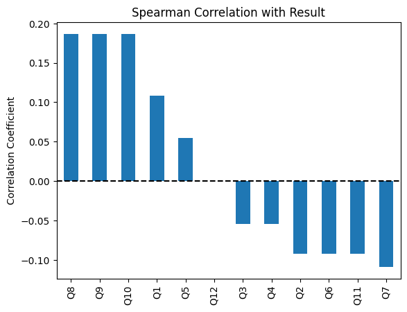
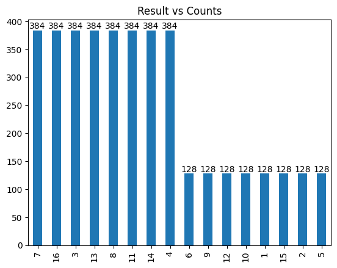

# TAIWAN-DESIGN-EXPO-23-in-NEW-TAIPEI-CITY
The purpose of this repository is to explore the underlying methodology of a web-based psychological test called[《找找圈內人！》](https://event.designexpo.org.tw/) that was developed by the TAIWAN DESIGN EXPO '23, a design exhibition held in New Taipei City.

## Data Collection

## Data Analysis

Firstly, the Spearman correlation analysis revealed that not every question showed a positive correlation with the result. Surprisingly, Question 12 exhibited no correlation with the result, which was an unexpected finding.

 

  

 

Then, the frequency of each result varied and could be divided into two categories: the higher group (384) and the lower group (128), with the lower group being exactly one-third of the higher group.

 

  

 

### :star: If this project is helpful to you, please help star this repo. Thanks! :hugs:

