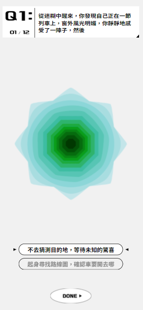
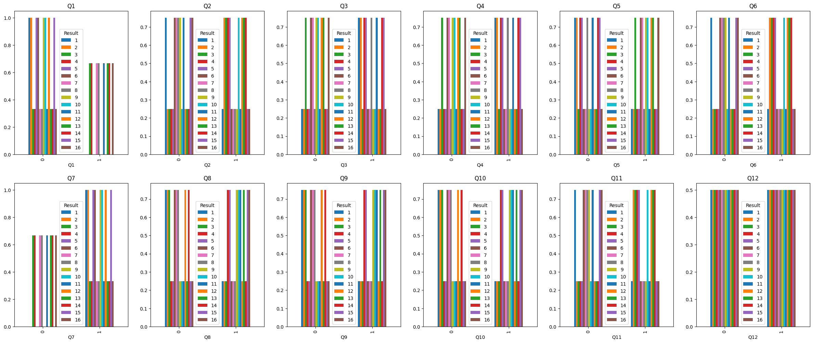

# TAIWAN-DESIGN-EXPO-23-in-NEW-TAIPEI-CITY
The purpose of this repository is to explore the underlying methodology of a web-based psychological test called[《找找圈內人！》](https://event.designexpo.org.tw/) that was developed by the TAIWAN DESIGN EXPO '23, a design exhibition held in New Taipei City.

 

  

 

## Data Collection

There are 12 questions in this web-based psychological test, and each question contains 2 options. All possible combinations were tested using Selenium. The results, 4096 in total (0 representing the first option and 1 representing the other option), are saved together in a file named 'DesignExpo2023.csv'.

 

  

 

## Data Analysis

Firstly, the Spearman correlation analysis revealed that not every question showed a positive correlation with the result. Surprisingly, Question 12 exhibited no correlation with the result, which was an unexpected finding.

 

  

 

Then, the frequency of each result varied and could be divided into two categories: the higher group (384) and the lower group (128), with the lower group being exactly one-third of the higher group.

 

  

 

The higher group contains Q7, Q16, Q3, Q13, Q8, Q11, Q14, Q4, while the lower group contains  Q6, Q9, Q12, Q10, Q1, Q15, Q2, Q5.
For the further research, the distribution of answers for each question was ploted, which is grouped by the result.

 

  

 

The plot above reveals that 

### ⭐ If this project is helpful to you, please help star this repo. Thanks!  :hugs: 

