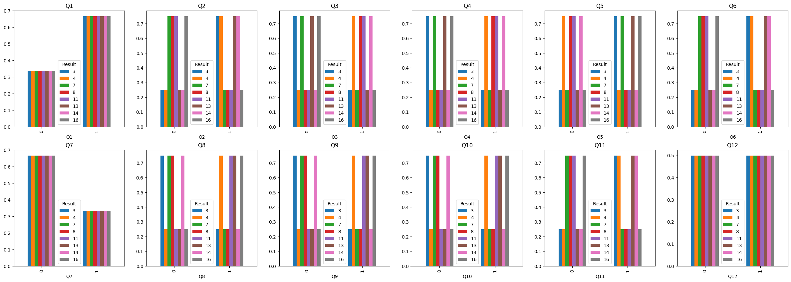
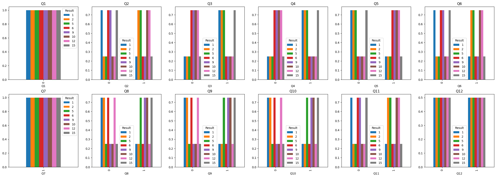
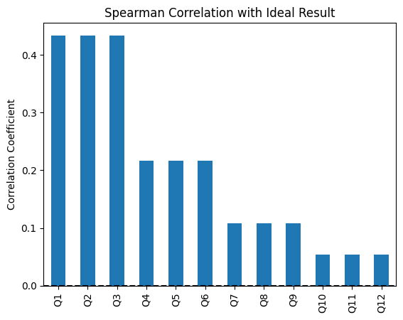
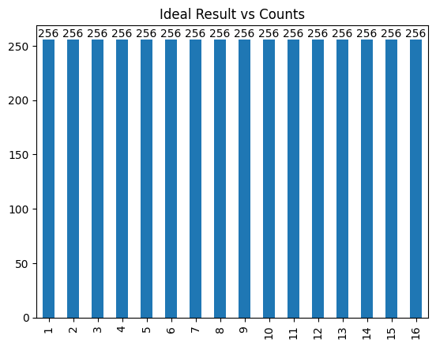
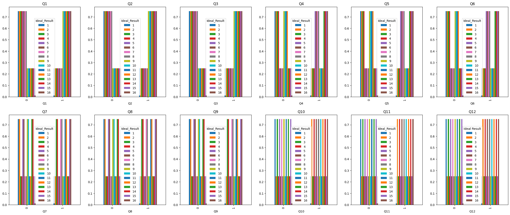
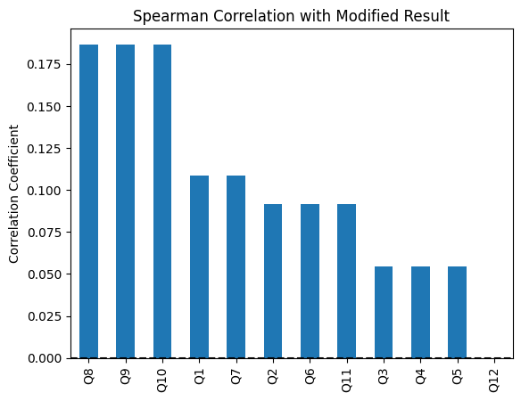
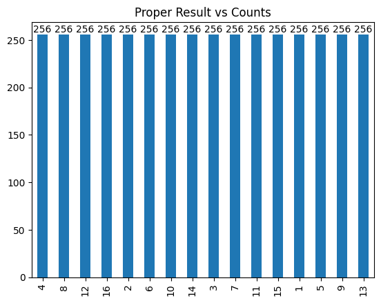

# TAIWAN-DESIGN-EXPO-23-in-NEW-TAIPEI-CITY
The purpose of this repository is to explore the underlying methodology of a web-based psychological test called[《找找圈內人！》](https://event.designexpo.org.tw/) that was developed by the TAIWAN DESIGN EXPO '23, a design exhibition held in New Taipei City. Users were classified into 16 distinctive social types according to their choices made when encountering intriguing elements during a magical journey.

 

  

 

## Data Collection

There are 12 questions in this web-based psychological test, and each question contains 2 options. All possible combinations were tested using Selenium. The outcome, 4096 in total (**0 representing the first option and 1 representing the other option**), are saved together in a file named 'DesignExpo2023.csv'. By the way, 16 kinds of test results were recorded as integer 1 ~ 16.

 

  

 

## Data Analysis

Firstly, the Spearman correlations analysis revealed that not every correlation of question positive with the result. Surprisingly, **Question 12 exhibited no correlation with the result**, which was an unexpected finding.

 

  

 

Then, the frequency of each result varied and could be divided into two categories: the higher group (*384*) and the lower group (*128*), with the lower group being exactly **one-third** of the higher group.

 

  

 

The higher group contains **Q7, Q16, Q3, Q13, Q8, Q11, Q14, Q4**, while the lower group contains  **Q6, Q9, Q12, Q10, Q1, Q15, Q2, Q5**.

For the further research, the distribution of choices for each question was ploted, which was grouped by the result and normalized for the difference of those two group.

 

  

 

The preceding visualization confirmed that the choices pertaining to Q12 didn't bear any significant influence on the outcomes. For most questions, choosing one option would have **three times** the probability of leading to a certain result than another option. However, choices in **Q1 and Q7 didn't lead to certain half of the potential results**.

For expanded understanding, the analysis was conducted once again, this time focusing on the higher group and the lower group separately.

 

  

 

The outcome of the higher group also revealed that the choices pertaining to Q12 didn't bear any significant influence on the results, while choosing one option would have three times the probability of leading to a certain result than another option for most question. But choosing one option would have **only two times** the probability of leading to a certain result than another option for Q1 & Q7.

 

  

 

The outcome of the lower group also revealed that the choices pertaining to Q12 didn't bear any significant influence on the results, while choosing one option would have three times the probability of leading to a certain result than another option for most question. But **certain option didn't lead to any result in the lower group for Q1 & Q7**.

## Hypothesis

Based on the existence of 16 distinct results, it was reasonable to postulate that the underlying logic of this test might be rooted in Myers-Briggs Type Indicator (MBTI) principles, while the classification was presumed to occur via voting every three questions. In order to verify this conjecture, `ideal results` were generated through a sequential voting process from Q1 to Q12 per every three questions. The image below represents the Spearman correlation analysis of `ideal results`. The correlations appeared akin to a four-step staircase due to the datatype of the result (int), which was similiar to the ones of not ideal results.

 

  

 

Not surprisingly, the counts of the results were distributed evenly.

 

  

 

The distribution of ideal choices for each question grouped by the ideal result revealed that choosing one option would have three times the probability of leading to a certain result than another option for **every** question.

 

  

 

## Bug
As above mentioned, the correlations of ideal results appeared akin to a **four-step** staircase, and so did the correlations of not ideal ones after making all negative correlations postive by swaping the two options of them and making the correlation of Q12 same as Q1 or Q7. Thus, Q12 was supposed to be the same voting group as Q1 &  Q7 according to "MBTI hypothesis". In other words, the relevance of Q12 may have been overlooked or excluded in the underlying logic during the creation of the website. Anyway, the image below is the correlations of not ideal ones after making all negative correlations postive by swaping the two options of them, which also manifests a **four-step staircase** pattern.

 

  

 

## Conclusion

From the image above, it can be almost conclusively deduced that the underlying logic of this web-based psychological test aligns with the "MBTI hypothesis", which was grouped as `[Q8, Q9, Q10]`, `[Q1, Q7, Q12]`, `[Q2, Q6, Q11]` and `[Q3, Q4, Q5]`. The picture below is the amount of each kind of result after making all negative correlations postive in the correlations of not ideal results by swaping the two options of them and voting result according to the groups inferenced, which further reinforces the correctness of the aforementioned inference.

 

  

 

## Postscript

Cuz the URL of this web-based psychological test is no longer valid, you can try [this Google Form](https://forms.gle/zGVjuFpReFkmLi6j8) (Chinese ver. only) instead if you really wanna know your social types. The result will be sent to your email from mine (pikasxyz@gmail.com). If not, plz send a mail to me for notification.

### ⭐ If this project is helpful to you, please help star this repo. Thanks!  :hugs: 

